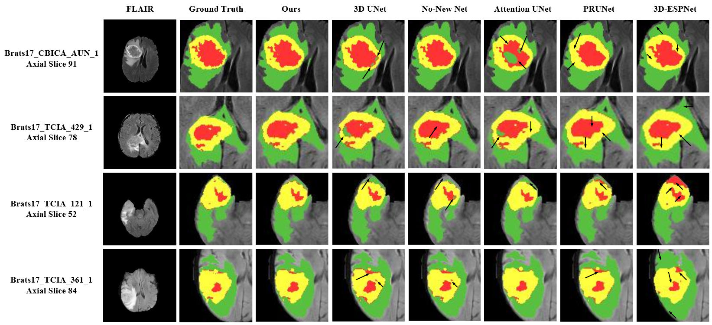

# CANet: Context Aware Network for Brain Glioma Segmentation Code

This is the official public PyTorch implementation for our paper [CANet: Context Aware Network for Brain Glioma Segmentation](https://arxiv.org/pdf/2007.07788.pdf),
which was accepted by [IEEE Transactions on Medical Imaging](https://ieeexplore.ieee.org/document/9378564).

## Dependencies

- Python (>=3.6)
- Pytorch (>=1.3.1)
- opencv-python
- matplotlib
- h5py
- medpy
- scikit-image
- nibabel

## Data Preparation

The dataset is obtained from [Multimodal Brain Tumor Segmentation Challenge (BraTS)](https://www.med.upenn.edu/cbica/brats2020/). Place the downloaded dataset in the right directory according to your path in `systemsetup.py` and run the pre-processing code `dataProcessing/brats18_data_loader.py`, `dataProcessing/brats18_validation_data_loader.py`. You will get the `data_3D_size_160_192_160_res_1.0_1.0_1.0.hdf5` and `data_3D.hdf5` for training and validation respectively.

## Training

Set a correct directory path in the `systemsetup.py`. Run

```bash
python train.py
```

## Validation/Testing

Set a correct directory path in the `systemsetup.py`. Uncomment the paramters in your experiments file (here `experiments/canet.py`) and run `train.py`.

```python
VALIDATE_ALL = False
PREDICT = True
RESTORE_ID = YOUR_CKPT_ID
RESTORE_EPOCH = 199
```
```bash
python train.py
```

## Visualize Segmentation Probability Map

Also uncomment the paramter `VISUALIZE_PROB_MAP` in your experiments file (here `experiments/canet.py`) and run `train.py`.

```python
VISUALIZE_PROB_MAP = True
```
```bash
python train.py
```

## Ablation Study on CGACRF Iteration

To validate different impacts brought by diffent iteration numbers of CGA-CRF. You can comment or add the mean-field convolution operation blocks in `experiments/canet.py`.

```python
self.crffusion_1 = CGACRF(inter_channels, inter_channels, inter_channels)
self.crffusion_2 = CGACRF(inter_channels, inter_channels, inter_channels)
self.crffusion_3 = CGACRF(inter_channels, inter_channels, inter_channels)
#self.crffusion_4 = CGACRF(inter_channels, inter_channels, inter_channels)
#self.crffusion_5 = CGACRF(inter_channels, inter_channels, inter_channels)
```


## Add Other Models

You can add your own network as a script under the `experiments` folder and import it in the `train.py`

```python
import experiments.your_experiment as expConfig
```



## TODO:

- [ ] There are dimension empty exceptions in projection with adaptive sampling, I am fixing it.
- [ ] Code Cleaning.

------
## Acknowledgement
The data preparation, training and testing pipeline is from [PartiallyReversibleUnet](https://github.com/RobinBruegger/PartiallyReversibleUnet). Thanks a lot for the great work! 

------
If you find CANet useful in your research, please consider citing:
```
@article{liu2021canet,
        title={CANet: Context Aware Network for Brain Glioma Segmentation},
        author={Liu, Zhihua and Tong, Lei and Chen, Long and Zhou, Feixiang and Jiang, Zheheng and Zhang, Qianni and Wang, Yinhai and Shan, Caifeng and Li, Ling and Zhou, Huiyu},
        journal={IEEE Transactions on Medical Imaging},
        year={2021},
        publisher={IEEE}
}
```
